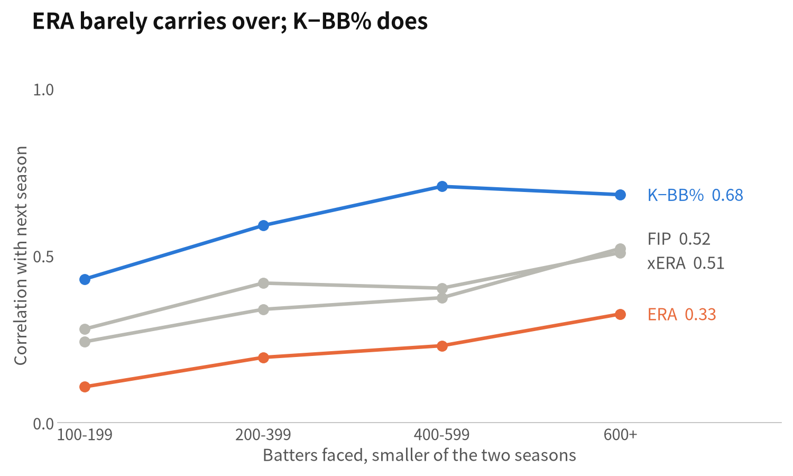
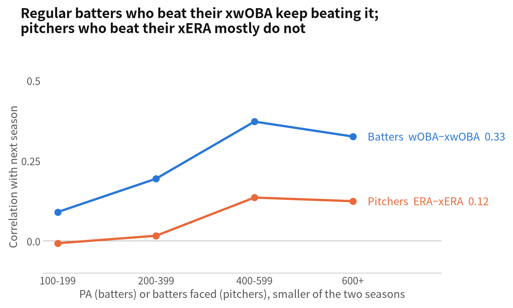
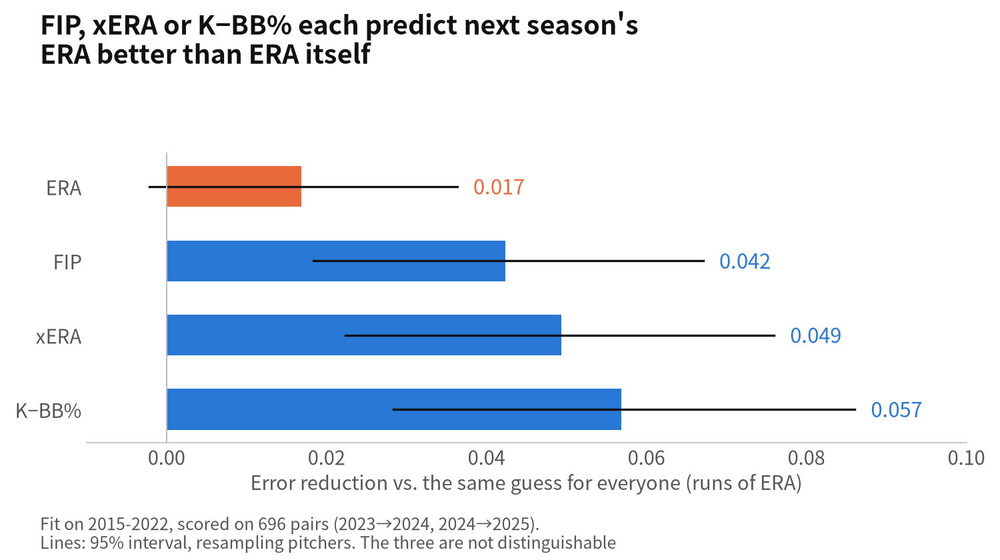

# dbt marts

Analysis-ready tables built on top of the raw parquet this repo publishes to
[yasumorishima/mlb-stats](https://huggingface.co/datasets/yasumorishima/mlb-stats).
dbt-core + DuckDB, so it runs anywhere for free: DuckDB reads the parquet over
HTTPS and nothing has to be downloaded or loaded first. The same SQL also
builds on BigQuery (see [BigQuery](#bigquery-sandbox)); every model and test
passes on both (with the same one warning), and the two builds agree on every
cell (text and integers exactly, floats within 2e-15).

## Layers

| Layer | Materialized | What happens there |
| --- | --- | --- |
| `staging/` (`stg_*`) | view | One model per raw table: rename, type, rescale percents to 0-1. No joins. |
| `intermediate/` (`int_*`) | view | League totals per season and the FIP constant. |
| `marts/` (`mart_*`) | table | What an analyst reads; published to Hugging Face. |
| `bi/` (`bi_*`) | table | What the dashboard reads (built, not published). |
| seed `mlb_teams` | table | The 30 franchises by team id: abbreviation, 2026 name, league, division. |

| Mart | Grain | Use |
| --- | --- | --- |
| `mart_batter_season` | batter-season, PA > 0 | Player evaluation: outcomes (wOBA, wRC+, WAR) next to process (xwOBA, batted-ball mix, bat speed, sprint speed, OAA). `woba_minus_xwoba` is the luck/skill gap in one column. |
| `mart_pitcher_season` | pitcher-season | K%, BB%, K-BB%, FIP rebuilt from the table, xERA, ERA - xERA, pitch-mix breadth. |
| `mart_batter_aging_pairs` | batter, season and season + 1 | Input for aging / development curves (delta method or a hierarchical model), weighted by the harmonic mean of PA. |
| `mart_pitch_arsenal_scouting` | pitcher-season-pitch | Usage rank plus whiff and run-value percentiles within the same pitch type and season. |
| `mart_scouting_reliability` | metric x sample-size bin | Year-to-year correlation of each pitch metric for the same pitcher and pitch type, raw and within pitch type: how far a one-season number can be trusted. Write-up: [JP](https://zenn.dev/shogaku/articles/mlb-pitch-metric-reliability-memo) / [EN](https://dev.to/yasumorishima/does-a-pitchs-performance-carry-over-to-next-season-whiff-rate-vs-run-value-on-8022-mlb-pairs-bj). |
| `mart_batter_process_reliability` | metric x PA bin | For the same batter in consecutive seasons: how much wOBA, xwOBA, their gap, BABIP, K%, BB% and ISO carry over, and how well each predicts next season's wOBA. |
| `mart_pitcher_process_reliability` | metric x BF bin | For the same pitcher in consecutive seasons: how much ERA, FIP, xERA, ERA - xERA, K-BB%, K%, BB% and xwOBA allowed carry over, and how well each predicts next season's ERA. |
| `mart_fielding_running_reliability` | metric x position / competitive-run bin | For the same player in consecutive seasons: how much OAA, fielding runs prevented and the catch-rate gap carry over at each position, and how much sprint speed and home-to-first time carry over by number of competitive runs. |

| BI table | Grain | Adds to the mart |
| --- | --- | --- |
| `bi_batter_season` | batter-season | Team abbreviation, league, division; 0-100 season percentiles (100 = best end, so K% is reversed) for wOBA, xwOBA, wRC+, K%, BB%, ISO, bat speed, sprint speed, OAA, among batters with PA >= 40% of the season's PA leader (about 300 PA in a full season, scales with 2020 and a season in progress). |
| `bi_pitcher_season` | pitcher-season | Team, SP/RP role (SP when at least half the games were starts), percentiles for K%, BB%, K-BB%, FIP, xERA, xwOBA allowed among pitchers with BF >= 30% of the leader (about 250 BF, so full-time relievers are ranked). |
| `bi_pitch_arsenal` | pitcher-season-pitch | The pitcher's name and team; the mart's within-type percentiles on the same 0-100 scale. |

The dashboard: [MLB Scouting Dashboard](https://lookerstudio.google.com/reporting/9c1d9fa2-c796-45a0-85de-633a888c4fd9) (Looker Studio, viewable by anyone with the link; pages Batters, Pitchers and Pitch arsenal; season 2025 by default). The same three tables, exported to CSV, also back a [Tableau Public version](https://public.tableau.com/app/profile/y.m7878/viz/MLBScoutingDashboard/1) (one page with all three tables and a single season selector) (a snapshot as of 2026-09-27, since Tableau Public web authoring reads uploaded files and has no BigQuery connector).

## Run it

```bash
pip install -r dbt/requirements.txt
cd dbt
dbt build --profiles-dir .                                   # reads from Hugging Face
dbt build --profiles-dir . --vars "{raw_base: /path/to/dir}" # or from local parquet
```

The DuckDB file lands in `dbt/target/mlb.duckdb` (override with `MLB_MARTS_DB`).
CI (`.github/workflows/dbt_marts.yml`) runs the same build on every change to
`dbt/` and after every successful weekly refresh. On master, when every model and
test passes, `export_marts.py` writes the four marts to parquet and they are
published to the dataset under
[`marts/`](https://huggingface.co/datasets/yasumorishima/mlb-stats/tree/main/marts),
so dashboards and models can read them without running dbt.

## BigQuery (sandbox)

The `bigquery` target builds the same models in the GCP project
`mlb-marts-sandbox`, which has **no billing account** (BigQuery sandbox: free,
1 TiB of queries a month, tables expire after 60 days, and 10 GiB of storage
for the life of the project that deleting data does not give back). The
Hugging Face dataset stays the source of truth; BigQuery is a second engine
for the same marts, not a store.

- `load_raw_bigquery.py <revision>` copies each raw source table from one
  dataset revision into the `mlb_raw` dataset with a batch load job (free and
  allowed in the sandbox; streaming inserts and DML are not) and checks the
  row count against the parquet. A revision that is already loaded is not
  loaded again. Measured 2026-09-27: raw 19 MB (written only when the
  revision changes), marts 6.0 MB and dashboard tables 6.2 MB (rewritten by
  every build), so about 1.1 GB a year at one new revision a week in season,
  some nine years of the lifetime allowance.
  Each raw table's expiry is set 59 days out on every run, including a run
  that loads nothing: off-season refreshes can leave the revision unchanged
  for months, and the tables would otherwise expire under the weekly build.
- `dbt build --profiles-dir . --target bigquery` then builds and tests
  everything into `mlb_marts`. Credentials: Application Default Credentials,
  or an OAuth access token in `BQ_ACCESS_TOKEN`.
- CI runs both steps in the `bigquery` job of `dbt_marts.yml`, only on master
  and only after the DuckDB build passed, with the same input revision. No key
  is stored in GitHub: the job's OIDC token is exchanged through Workload
  Identity Federation, and the provider accepts only this workflow file on this
  repository's master branch.

What had to change so one set of SQL runs on both engines:

| DuckDB-only | Portable form | Why |
| --- | --- | --- |
| `x::double` | `cast(x as {{ float_type() }})` | `dbt.type_float()` is FLOAT, which is 32-bit on DuckDB |
| `count(*) filter (where c)` | `count(case when c then 1 end)` | no FILTER clause on BigQuery |
| `arg_max(pitch_type, usage)` | `row_number()` ordered by usage, then pitch code | also fixes 13 tied pitcher-seasons whose primary pitch was arbitrary |
| `"positional"` | `{{ adapter.quote("positional") }}` | a double-quoted name is a string literal on BigQuery |
| bare `sprint_speed` from table `sprint_speed` | `s.sprint_speed` | BigQuery resolves the bare name to the table (a STRUCT of the row) |
| `accepted_values: [100, 200, ...]` | same, with `quote: false` | BigQuery will not compare INT64 with a string |
| contract `data_type: double` | `float64` on BigQuery, `double` on DuckDB | the contract types are adapter-specific |

## Result vs process for batters

`mart_batter_process_reliability` (build of 2026-09-27): pairs of consecutive
finished seasons 2015-2025 with 100+ PA in each. The 60-game 2020 season is
kept; its pairs sit mostly in the low bins. Correlations, same batter:

| smaller PA of the pair | pairs | wOBA with next wOBA | xwOBA with next xwOBA | wOBA - xwOBA with next gap | xwOBA with next wOBA |
| --- | ---: | ---: | ---: | ---: | ---: |
| 100-199 | 974 | 0.23 | 0.42 | 0.09 | 0.29 |
| 200-399 | 1,239 | 0.32 | 0.54 | 0.19 | 0.40 |
| 400-599 | 811 | 0.44 | 0.66 | 0.37 | 0.47 |
| 600+ | 322 | 0.53 | 0.66 | 0.33 | 0.53 |

- xwOBA repeats better than wOBA at every sample size, and predicts next
  season's wOBA better than wOBA itself up to 600 PA, where the two tie.
- Part of the gap repeats (correlation 0.33 to 0.37 with 400+ PA in both
  seasons), so xwOBA misses something stable about a batter. Among the traits
  in the mart, with 400+ PA (2,078 seasons), sprint speed goes with the gap
  the most (r = 0.21; pull-air rate 0.03). Bat speed, measured only since
  2023 (409 seasons), is as large with the opposite sign (-0.20).
- A held-out check: weights fitted on pairs starting 2015-2022 and scored on
  pairs starting 2023 and 2024 (509 pairs, 335 batters, 300+ PA the next
  season); fit and error both weighted by next season's PA; MAE of next
  season's wOBA. Last wOBA 0.02454, last xwOBA 0.02380, both 0.02371 (about
  70 % of the weight on xwOBA), a constant 0.02768. xwOBA minus wOBA is
  -0.00074 (95 % bootstrap over batters: -0.00148 to about 0); both minus
  wOBA is -0.00083 (-0.00138 to -0.00030). Adding sprint speed does not help
  (0.02383). One split, so read the size of the gain loosely.

## Result vs process for pitchers

`mart_pitcher_process_reliability` (build of 2026-09-29): pairs of consecutive
finished seasons 2015-2025 with 100+ batters faced and a Statcast xERA in
each (3,272 pairs). The 60-game 2020 season is kept; its pairs sit in the
two low bins (233 of 1,228 and 156 of 1,325). Correlations, same pitcher:

| smaller BF of the pair | pairs | ERA | FIP | xERA | K-BB% | ERA - xERA | ERA with next ERA | FIP with next ERA | xERA with next ERA |
| --- | ---: | ---: | ---: | ---: | ---: | ---: | ---: | ---: | ---: |
| 100-199 | 1,228 | 0.11 | 0.24 | 0.28 | 0.43 | -0.01 | 0.11 | 0.18 | 0.21 |
| 200-399 | 1,325 | 0.20 | 0.34 | 0.42 | 0.59 | 0.02 | 0.20 | 0.27 | 0.32 |
| 400-599 | 369 | 0.23 | 0.37 | 0.40 | 0.71 | 0.14 | 0.23 | 0.30 | 0.29 |
| 600+ | 350 | 0.33 | 0.52 | 0.51 | 0.68 | 0.12 | 0.33 | 0.39 | 0.38 |



- ERA repeats the least of the four at every sample size; FIP and xERA sit
  in between; K-BB% repeats the most.
- Beating xERA mostly does not repeat (ERA - xERA: about 0 below 400 BF,
  0.12 to 0.14 above). For regular batters the gap (wOBA - xwOBA) repeats at
  0.33 to 0.37 with 400+ PA (0.09 and 0.19 below that), so "outperforms the
  expected stats" holds up much better for batters than for pitchers. The
  chart puts PA and batters faced on one axis; 400 BF is roughly a
  95-inning pitcher, not the same player as a 400-PA batter.



- A held-out check: one-variable fits on pairs starting 2015-2022, scored on
  pairs starting 2023 and 2024 (696 pairs, 457 pitchers); fit and error both
  weighted by next season's BF; MAE of next season's ERA. A constant 0.914,
  last ERA 0.897, FIP 0.871, xERA 0.864, K-BB% 0.857. Against last ERA,
  95 % intervals from resampling pitchers: FIP -0.026 (-0.042 to -0.010),
  xERA -0.032 (-0.051 to -0.014), K-BB% -0.040 (-0.065 to -0.016); last ERA
  against the constant -0.017 (-0.036 to +0.002). K-BB% and xERA cannot be
  told apart in this split (-0.008, -0.028 to +0.012), nor can K-BB% and FIP
  or FIP and xERA, so the order of the three is not a ranking. In the
  training fit, last ERA gets a weight near zero (slightly negative) once
  FIP or xERA is in. The chart's intervals are against the constant. One
  split, so read the size of the gain loosely.



## Fielding and running

`mart_fielding_running_reliability` (build of 2026-09-30): pairs of
consecutive finished seasons, 2016-2025 for fielding (1,401 pairs, same
player at the same position, qualified fielders only) and 2015-2025 for
running (4,345 pairs for sprint speed, 3,698 for home to first).
Correlations, same player:

| position | pairs | OAA | fielding runs prevented | catch rate above expected |
| --- | ---: | ---: | ---: | ---: |
| 1B | 212 | 0.26 | 0.28 | 0.14 |
| 2B | 201 | 0.46 | 0.44 | 0.41 |
| 3B | 205 | 0.41 | 0.41 | 0.39 |
| SS | 228 | 0.44 | 0.44 | 0.46 |
| LF | 164 | 0.44 | 0.45 | 0.44 |
| CF | 204 | 0.51 | 0.52 | 0.48 |
| RF | 187 | 0.51 | 0.51 | 0.52 |

| smaller competitive runs of the pair | pairs | sprint speed | mean change (ft/s) |
| --- | ---: | ---: | ---: |
| 10-24 | 696 | 0.89 | -0.14 |
| 25-49 | 817 | 0.93 | -0.12 |
| 50-99 | 1,168 | 0.94 | -0.15 |
| 100+ | 1,664 | 0.95 | -0.15 |

- Sprint speed is close to fixed from one season to the next even on 10 to
  24 runs, and a player loses about 0.15 ft/s a year on average. Home to
  first behaves the same (0.90 to 0.95).
- One season of OAA carries over about half as well (0.4 to 0.5 at most
  positions, 0.26 at first base). The Savant table has no attempt count, so
  these are not split by sample size; and it lists qualified fielders only,
  so part-time fielders are not in these numbers.
- The rate (actual minus expected catch rate, in whole points) carries over
  about as well as the total at every position except first base, so the
  totals are not repeating mainly through playing time.

## Data tests

Besides key uniqueness and value ranges on every mart:

- **Contracts** on every mart (`contract: {enforced: true}` in
  `models/marts/_marts.yml`): dbt refuses to build a mart whose columns,
  types or order differ from the declaration, and key columns are NOT NULL.
  The contract found that `oaa` and `fielding_runs_prevented` were published
  as DOUBLE (DuckDB types `sum(BIGINT)` as HUGEINT); they are BIGINT now.
- **Reliability recomputed** (`assert_scouting_reliability_recomputed`): every
  cell of `mart_scouting_reliability` is computed again another way (group-by
  means and joins instead of window functions and UNPIVOT) and must match.
  `assert_batter_process_reliability_recomputed` does the same for
  `mart_batter_process_reliability` with one join per metric, and
  `assert_pitcher_process_reliability_recomputed` for
  `mart_pitcher_process_reliability`.
  `assert_fielding_running_reliability_recomputed` reads the raw sources
  (not staging) and rebuilds each correlation from sums. These tests
  repeat the model's filters and bin edges, so they catch a wrong build of
  the table, not a wrong definition.

- **FIP reconciliation** (`assert_fip_matches_statsapi`): our FIP, with the
  league constant rebuilt from the same table, must equal the Stats API figure
  to 0.001 on every finished season with 20+ IP. As of the 2026-09-23 fetch it
  does on 5,695 of 5,696 rows (largest gap 0.0002); the one exception, a 2024
  season split across three teams, is listed by id. Partial seasons are
  excluded because the sabermetrics endpoint lags the counting stats.
- **Rate denominators** (`assert_rates_use_pa_and_bf`): K% x PA = SO and
  BB% x PA = BB for batters (BF for pitchers). A 0-1 range test notices K%
  over AB only on the 56 rows with AB = 0; this fails on every row.
- **ISO** (`assert_iso_from_total_bases`) from TB - H over AB, NULL when AB = 0,
  and **single-qualifier percentiles** (`assert_single_qualifier_pctile_is_null`)
  are NULL rather than 0.
- **PA identity** (`assert_pa_identity`): PA = AB + BB + HBP + SF + SH + CI.
  The Stats API is off by exactly one PA on 10 of 12,100 player-seasons (as of
  the 2026-09-23 fetch); those are a warning (`assert_pa_identity_off_by_one`),
  a larger gap fails.

Each of these was checked to fail on a deliberately broken model: wrong FIP
constant, an unaggregated OAA join that fans out rows, K% over HR, K% over AB,
Savant percents left on the 0-100 scale; a renamed column, a changed type,
a NULL key and the old OAA sum (contracts); and a lost within-type centring,
a moved bin edge, pairs joined across pitch types and in-progress seasons
kept (reliability).
